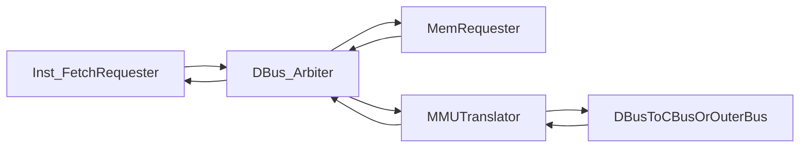

# MMU 总线事务统一重构计划

## 目标

将当前“多处各自维护事务状态”的实现，重构为“每层职责单一、握手语义一致”的链路，确保：

- 请求 `valid` 在事务完成前持续有效
- 响应只回流给该事务 owner
- `MEM` 只在本事务完成后前进
- `IF` 与 `MEM` 的事务边界互不污染

## 关键决策

- **交付策略**：一次性完成重构改动（不再分阶段补丁）。
- **本机执行策略**：本轮不在这台机器上运行 lint 或测试，改为提供明确的外部验证清单。
- **Instruction Memory 抽象**：不恢复独立 ibus/Instruction Memory 物理总线抽象；保留 `Inst_FetchRequester` 逻辑抽象，统一复用单 dbus + 方案二外层 MMU。

## 现状根因归纳

- [vsrc/src/MEM/Fetch_Data.sv](/Users/zhaojingyan/Code/26-Arch/vsrc/src/MEM/Fetch_Data.sv) 同时承担对齐、事务 owner、完成判定，状态复杂，且与上游 `inst_ctx` 生命周期耦合。
- [vsrc/src/MMU/DBus_Arbiter.sv](/Users/zhaojingyan/Code/26-Arch/vsrc/src/MMU/DBus_Arbiter.sv) 维护另一套 owner/busy 语义，和 `Fetch_Data` 的等待模型存在边界不一致。
- [vsrc/src/MMU/MMU.sv](/Users/zhaojingyan/Code/26-Arch/vsrc/src/MMU/MMU.sv) 再维护一套 `saved_request/state`，形成三层状态机串联，调试复杂度高。
- [vsrc/src/IF/Inst_Fetch.sv](/Users/zhaojingyan/Code/26-Arch/vsrc/src/IF/Inst_Fetch.sv) 仍依赖“当前 PC 解释返回数据”的假设，和全局 stall/jump 边界敏感。

## 重构原则

- **单层单责**：
  - `Inst_Fetch` 只做“取指请求保持 + 返回绑定”；
  - `Fetch_Data` 只做“load/store 字节对齐与扩展”；
  - `DBus_Arbiter` 只做“二选一 owner + 请求保持 + 响应回流”；
  - `MMU` 只做“地址变换状态机 + 上下游透传”。
- **统一握手协议**：请求一旦发起，`valid/addr/size/strobe/data` 在 `data_ok` 前不可变。
- **owner 一致性**：每层只认本层 owner，不跨层推断“当前槽位指令是谁”。
- **先可观测再优化**：先把正确性与可调试性做稳，再考虑并发优化。

## 目标数据流（重构后）

## 具体改造步骤

1. **冻结变更面并回到稳定骨架**

- 以当前“方案二接线”保留外层 MMU 位置（[vsrc/SimTop.sv](/Users/zhaojingyan/Code/26-Arch/vsrc/SimTop.sv), [vsrc/VTop.sv](/Users/zhaojingyan/Code/26-Arch/vsrc/VTop.sv), [vsrc/src/core.sv](/Users/zhaojingyan/Code/26-Arch/vsrc/src/core.sv), [vsrc/src/Top.sv](/Users/zhaojingyan/Code/26-Arch/vsrc/src/Top.sv)）。
- 明确后续只改以下行为模块：`Inst_Fetch`、`Fetch_Data`、`DBus_Arbiter`、`MMU`。

1. **重写 Inst_Fetch 为 requester FSM**

- 在 [vsrc/src/IF/Inst_Fetch.sv](/Users/zhaojingyan/Code/26-Arch/vsrc/src/IF/Inst_Fetch.sv) 引入显式状态：`IDLE/WAIT_RESP/HAVE_INST`。
- `WAIT_RESP` 期间请求字段固定为 `requested_pc`。
- 返回时用 `requested_pc[2]` 切片，不用当前 `pc_inst_address`。
- `is_inst_ready` 仅在 `HAVE_INST && cached_pc==pc_inst_address` 为真。

1. **重写 Fetch_Data 为 requester+aligner 解耦**

- 在 [vsrc/src/MEM/Fetch_Data.sv](/Users/zhaojingyan/Code/26-Arch/vsrc/src/MEM/Fetch_Data.sv) 分成两部分：
  - `MemRequester`：跟踪当前 MEM 指令事务（`IDLE/WAIT_RESP/DONE`），保持请求稳定；
  - `LoadAligner`：仅根据锁存的 `funct3/byte_idx` 处理返回数据。
- `is_mem_ready` 定义为：非访存立即 ready；访存仅在 `DONE && owner_match` 时 ready。
- 彻底去掉“通过当前槽位信号推断返回归属”的路径。

1. **重写 DBus_Arbiter 为严格单事务 owner 模型**

- 在 [vsrc/src/MMU/DBus_Arbiter.sv](/Users/zhaojingyan/Code/26-Arch/vsrc/src/MMU/DBus_Arbiter.sv) 定义状态：`IDLE/BUSY`。
- `IDLE` 选路并锁存完整请求 + owner；`BUSY` 持续输出锁存请求。
- 响应只回流给锁存 owner；支持“首拍即返回”但不允许空闲态误消费响应。

1. **收敛 MMU 上下游握手语义**

- 在 [vsrc/src/MMU/MMU.sv](/Users/zhaojingyan/Code/26-Arch/vsrc/src/MMU/MMU.sv) 明确：
  - `IDLE` 只在 `upstream.valid` 捕获一次请求；
  - 非 `IDLE` 期间 upstream 输入被忽略（由上游 requester 持有请求）；
  - `PASSTHROUGH/ACCESS/WALK`_* 均保持单事务，直到 `downstream.data_ok`。
- 保证对上游 `upstream_response` 的 `data_ok` 仅在该事务完成时拉高。

1. **控制层只消费 ready，不推断事务内部状态**

- 保持 [vsrc/src/CTRL/Control_Unit.sv](/Users/zhaojingyan/Code/26-Arch/vsrc/src/CTRL/Control_Unit.sv) 现有全局 stall 策略不变。
- 让 `if_2_ctrl.is_inst_ready` 与 `is_mem_ready` 的定义在 requester FSM 内自洽，控制层不再承载补偿逻辑。

1. **加入短期可观测调试信号（仅开发期）**

- 给 `Inst_Fetch`/`Fetch_Data`/`DBus_Arbiter`/`MMU` 增加 `state`、`owner_addr`、`waiting_response` 等只读观测信号（可通过注释标记为 debug-only）。
- 先通过波形验证 3 条关键不变量后再考虑删除/保留：
  - 请求保持不变直到 `data_ok`
  - 响应仅回流给 owner
  - `ready` 与 `MEM/WB` 更新同拍一致

## 外部验证清单（本机不执行）

- **关键案例**：围绕 `0x8000061c`/`0x80000620` 的 load-store 回环检查。
- **控制流案例**：检查 `0x8000027c` 附近 `ra/sp` 不再漂移。
- **提交活性**：确保无 `no instruction commit for 5000 cycles`。
- **不变量波形检查**：
  - `merged_dbus_req.`* 在事务完成前稳定；
  - `mmu.downstream_request.`* 与 `saved_request` 一致；
  - `mem_2_wb.rd_data` 在 `is_mem_ready && !stall` 时更新。

## 风险与回滚点

- 风险：一次改动模块较多，短期可能引入新接线错误。
- 缓解：按 requester→arbiter→mmu 顺序分步落地，每步可独立波形验收。
- 回滚：每步结束前保留清晰提交边界，便于回退到上一步稳定状态。

