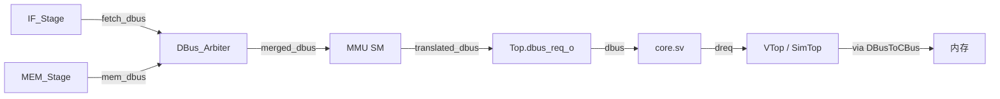

# MMU + DBus Arbiter 实现计划

## 1. 目标总线拓扑




弃用：`ibus_req_t / ibus_resp_t` 整条链 + `IBusToCBus.sv` + `CBusArbiter` 在 VTop / SimTop 的实例化（一条 cbus 不再需要仲裁）。

## 2. 新增模块

### 2.1 `vsrc/src/MMU/DBus_Arbiter.sv`

参考 [vsrc/util/CBusArbiter.sv](vsrc/util/CBusArbiter.sv) 的 2-input latched-index 模式，改用 `dbus_req_t / dbus_resp_t`：

- 端口：`mem_request / fetch_request`（input）+ `mem_response / fetch_response`（output）+ 下游 `dbus_request / dbus_response`
- 内部：`busy` 与 `index`（0=mem，1=fetch；mem 优先与 CBusArbiter 一致）
- `busy=0` 时空闲，按 valid 选请求并 latch index；`busy=1` 时把 `oresp` 路由回选中方
- 释放条件：下游 `data_ok` 拉高即视作单 beat 结束（dbus 单 beat，无需 `last`）

### 2.2 `vsrc/src/MMU/MMU.sv`

Sv39 page walker，纯 happy-path（不报 page fault）。

#### 端口

```
system_input: clk, rst_n
mmu_input:
  - upstream_request   : dbus_req_t      // 来自 DBus_Arbiter
  - downstream_response: dbus_resp_t     // 来自下游真实总线
  - satp               : u64
  - priv_mode          : PRIV_MODE
mmu_output:
  - upstream_response  : dbus_resp_t     // 给 DBus_Arbiter
  - downstream_request : dbus_req_t      // 给下游
```

#### 状态机（5 态）

- `IDLE`：等 upstream.valid；命中 `should_translate` → `WALK_L2`，否则进入 `PASSTHROUGH`
- `PASSTHROUGH`：`downstream_request = upstream_request`，`upstream_response = downstream_response`；`data_ok` 后回 `IDLE`
- `WALK_L2 / WALK_L1 / WALK_L0`：MMU 自驱 PTE 读
  - L2 base = `{satp[43:0], 12'b0}`，index = `vaddr[38:30]`
  - L1/L0 base = `{pte[53:10], 12'b0}`，index = `vaddr[29:21]` / `vaddr[20:12]`
  - PTE 地址 = `base + index * 8`；请求 `size=MSIZE8 / strobe=0 / data=0 / valid=1`
  - `data_ok` 时 latch `pte`，进入下一级；L0 完成 → `ACCESS`
- `ACCESS`：用 `{pte[53:10], vaddr[11:0]}` 替换 upstream 的 addr，其余字段（size / strobe / data）原样透传给 downstream；`data_ok` 时把 `downstream_response`（连同 addr_ok）回给 upstream，回 `IDLE`

#### 关键不变量

- `should_translate = (priv_mode != PRIV_M) && (satp[63:60] == 4'd8)`
- walk 过程中 `upstream_response.addr_ok = 0 / data_ok = 0`，upstream 的 `valid / addr` 由 dbus 合约（DBus_Arbiter latched index + 上游 stall）保证稳定
- walk 过程中 `downstream_request` 由 MMU 内部驱动；`PASSTHROUGH / ACCESS` 才把 upstream 原始/重写后的请求接到 downstream
- 唯一的写请求路径在 `PASSTHROUGH / ACCESS`；PTE 读永远是只读 64-bit

## 3. 修改现有模块

### 3.1 [vsrc/src/IF/IF_Stage.sv](vsrc/src/IF/IF_Stage.sv) / [vsrc/src/IF/Inst_Fetch.sv](vsrc/src/IF/Inst_Fetch.sv)

- IF_Stage 顶层 `ibus_request / ibus_response` → 改为 `dbus_request / dbus_response`
- Inst_Fetch 内部 `InstructionMemory` 实例 → 改用 `DataMemory`（dbus 适配器），`request_size=MSIZE4 / request_strobe=8'b0`，从 64-bit 响应里按 `pc[2]` 选 32-bit：

```
  inst_word = pc_inst_address[2] ? response_data[63:32] : response_data[31:0]
  

```

- 删除 [vsrc/src/IF/InstructionMemory.sv](vsrc/src/IF/InstructionMemory.sv)

### 3.2 [vsrc/src/Top.sv](vsrc/src/Top.sv)

- 删除 `ibus_req_o / ibus_resp_i` 端口
- 新增连线：`fetch_dbus_req / fetch_dbus_resp` / `mem_dbus_req / mem_dbus_resp` / `merged_dbus_req / merged_dbus_resp`
- 装配 `DBus_Arbiter` 与 `MMU`：

```
  IF_Stage --(fetch_dbus)--> DBus_Arbiter --(merged)--> MMU --(translated)--> dbus_req_o
                                  ^                            ^
                                  |                            |
  MEM_Stage --(mem_dbus)----------+   csr_state_o.satp + priv_mode_o
  

```

- 把 `csr_state_o.satp` 与 `priv_mode_o` 喂给 MMU

### 3.3 [vsrc/src/core.sv](vsrc/src/core.sv)

- 删除 `ireq / iresp` 端口与连线，Top 只保留单条 `dreq / dresp`

### 3.4 [vsrc/VTop.sv](vsrc/VTop.sv) / [vsrc/SimTop.sv](vsrc/SimTop.sv)

- 删除 `ibus_req_t / ibus_resp_t / icreq / icresp` 与 `IBusToCBus`、`CBusArbiter` 实例
- `DBusToCBus` 输出直接接到 `oreq / oresp`

### 3.5 [vsrc/src/top_pkg.sv](vsrc/src/top_pkg.sv)

可选：新增 `SATP_FIELDS` packed struct（`mode[63:60] / asid[59:44] / ppn[43:0]`），让 MMU 解码更直观。也可以直接用位选，不必额外类型。

## 4. 文件清单

新增：

- [vsrc/src/MMU/MMU.sv](vsrc/src/MMU/MMU.sv)
- [vsrc/src/MMU/DBus_Arbiter.sv](vsrc/src/MMU/DBus_Arbiter.sv)

删除：

- [vsrc/src/IF/InstructionMemory.sv](vsrc/src/IF/InstructionMemory.sv)

修改：

- [vsrc/src/IF/IF_Stage.sv](vsrc/src/IF/IF_Stage.sv)
- [vsrc/src/IF/Inst_Fetch.sv](vsrc/src/IF/Inst_Fetch.sv)
- [vsrc/src/Top.sv](vsrc/src/Top.sv)
- [vsrc/src/core.sv](vsrc/src/core.sv)
- [vsrc/VTop.sv](vsrc/VTop.sv)
- [vsrc/SimTop.sv](vsrc/SimTop.sv)
- [design/arch_v2.md](design/arch_v2.md)（新增 §3.10 MMU + §3.11 DBus_Arbiter，更新 §3.1 IF 改用 dbus、§3.8 Top 装配图）

不动：

- [vsrc/util/CBusArbiter.sv](vsrc/util/CBusArbiter.sv)（保留代码但不再实例化；如要彻底清理可后续单独 PR）
- [vsrc/util/IBusToCBus.sv](vsrc/util/IBusToCBus.sv)（同上）
- [vsrc/mycpu_top.sv](vsrc/mycpu_top.sv)（端口都是 cbus 级，无需改）

## 5. 风险与注意点

- **DBus_Arbiter 的 latched index**：response 路由必须基于 latched index，不能用当拍 select；MMU 的多 beat walk 期间 arbiter 必须保持 busy
- **Inst_Fetch 32-bit 切片**：dbus 返回 64-bit，需按 `pc[2]` 切出 32-bit 指令字；不复用 `DRESP_TO_IRESP` 宏（避免再引入 ibus 类型），直接组合切片
- **MMU 单槽 PTE**：本轮不做 TLB，每次 walk 都打三次 dbus；fetch / load / store 性能下降可接受
- **page fault**：本轮承诺 happy-path，PTE.V / PTE.U / PTE.X / 大页 / misalign 这些先不检查（设计文档里要写明遗留）
- **satp / priv_mode 时序**：`csr_state_o.satp` 与 `priv_mode_o` 已是同步寄存器输出，MMU 当拍读即可；写 satp 的指令本身走 CSR JT_CSR flush 路径，已天然把后续指令清掉再以新 satp 走 walk

