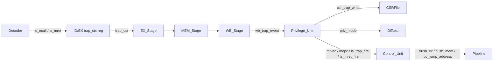

## 顶层数据流增量




---

## 1. 新增/扩展类型 ([vsrc/src/top_pkg.sv](vsrc/src/top_pkg.sv))

```systemverilog
typedef enum logic [1:0] {
    PRIV_U = 2'b00,
    PRIV_S = 2'b01,  // 预留
    PRIV_M = 2'b11
} PRIV_MODE;

// 贯穿型 bundle，与 INST_CTX 并行，ID -> EX -> MEM -> WB
typedef struct packed {
    logic       is_ecall;
    logic       is_mret;
    logic       exc_valid;   // Lab 6 预留：同步异常已成立
    logic [3:0] exc_cause;   // mcause 低 4 位（ecall 时由 Privilege_Unit 按 priv 重写）
    u64         exc_tval;    // mtval 写入值，ecall 时为 0
} TRAP_CTX;

// WB -> Privilege_Unit：trap 事件
typedef struct packed {
    logic    is_trap_commit; // 当前 WB 拍真正 commit（与 commit_valid 一致）
    TRAP_CTX trap_ctx;       // 来自 MEM/WB 寄存器的 trap_ctx
    u64      epc;            // 当前 commit 指令的 PC（= inst_ctx.pc_inst_address）
} WB_TRAP_EVENT;

// Privilege_Unit -> Control_Unit：trap-redirect 反馈
typedef struct packed {
    logic is_trap_fire;       // ecall / 同步异常 / 未来异步中断
    logic is_mret_fire;       // mret 指令
    u64   trap_vector;        // mtvec（direct 模式直用；vectored 暂不实现）
    u64   mepc_value;         // mepc
} PRIV_2_CTRL;
```

`ID_PKG.sv` 新增 ECALL/MRET 识别常量；`CSR_PKG.sv` 新增 cause 编码（`MCAUSE_ECALL_U = 8`、`MCAUSE_ECALL_M = 11`）。

---

## 2. Decoder ([vsrc/src/ID/Decoder.sv](vsrc/src/ID/Decoder.sv))

`OP_SYSTEM` 分支新增 funct3=000 的二级判定：

```systemverilog
3'b000: begin
    unique case (inst[31:20])
        12'h000: is_ecall = 1'b1;  // ECALL
        12'h302: is_mret  = 1'b1;  // MRET
        default: ;                  // EBREAK / WFI 暂不支持，走 NOP
    endcase
end
```

新增端口 `output logic is_ecall, is_mret`。ECALL/MRET：

- `rd_addr / rs1_addr / rs2_addr` 不读不写（保持原始 5'b0，无副作用）
- `jump_type = JT_NONE`（不走 EX 段 jump 路径，由 Privilege_Unit/Control_Unit 在 WB 段统一接管）
- 其他 CSR/ALU 控制保持默认

---

## 3. ID Stage ([vsrc/src/ID/ID_Stage.sv](vsrc/src/ID/ID_Stage.sv))

- ID/EX 寄存器新增 `TRAP_CTX trap_ctx` 输出，逻辑与 `inst_ctx / id_2_ex / id_2_fwd / csr_write` 平行：
  - `rst_n` 或 `insert_bubble` 时整体清零
  - `!stall` 时 latch `dec_is_ecall / dec_is_mret`，`exc_valid/exc_cause/exc_tval` 留 0（Lab 6 在此填）

---

## 4. EX / MEM Stage（[EX_Stage.sv](vsrc/src/EX/EX_Stage.sv)、[MEM_Stage.sv](vsrc/src/MEM/MEM_Stage.sv)）

- 增加 `input TRAP_CTX trap_ctx_in / output TRAP_CTX trap_ctx_out`，与现有 `csr_write` 同节奏 latch
- 增加 `input logic flush`，优先级：`rst_n > flush > !stall`（MEM 还要 `&& is_mem_ready`）。`flush` 高时把 inst_ctx_out / ex_2_mem (or mem_2_wb) / csr_write_out / trap_ctx_out **整体清零**，等效于注入 NOP

---

## 5. WB Stage ([vsrc/src/WB/WB_Stage.sv](vsrc/src/WB/WB_Stage.sv))

- 新增 `input TRAP_CTX trap_ctx`
- 新增 `output WB_TRAP_EVENT wb_trap_event`：
  - `is_trap_commit` 由 Top 计算的 `commit_valid` 反向喂进来（避免冻结拍重复 fire）
  - `epc = inst_ctx.pc_inst_address`
- ECALL/MRET 不写 RegFile / CSR，原有 `wb_2_id.write_en = (rd_addr != 0)` 与 `wb_2_csr` 已天然安全

---

## 6. CSRFile ([vsrc/src/ID/CSRFile.sv](vsrc/src/ID/CSRFile.sv))

- 新增 trap-write 端口：

```systemverilog
  input  logic       trap_write_en,
  input  u64         trap_mstatus_next,
  input  u64         trap_mepc_next,
  input  u64         trap_mcause_next,
  input  u64         trap_mtval_next,
  

```

- 新增直出 `output u64 mtvec_value, mepc_value`（供 Privilege_Unit 与 Control_Unit 读现值，不用穿 csr_state 复用）
- 写端口优先级：`trap_write_en > write_en (软件 CSR 写)`。两者由 Privilege_Unit 协调，已保证同拍互斥（trap fire 拍 wb_2_csr.write_en 一定为 0，因为 ECALL/MRET 不是 Zicsr 指令）
- MCAUSE / MTVAL / MEPC 复位与原有逻辑一致，不加 WARL mask（已是直写）

---

## 7. Privilege_Unit（新增 [vsrc/src/CTRL/Privilege_Unit.sv](vsrc/src/CTRL/Privilege_Unit.sv)）

**纯职责模块**，集中处理特权级 + trap 协调。

输入：

- `wb_trap_event`：WB 反馈
- `mstatus / mtvec_value / mepc_value`：来自 CSRFile 当拍读出
- 预留：`interrupt_pending`（Lab 6，先吊空）

输出：

- 给 CSRFile：`trap_write_en / trap_mstatus_next / trap_mepc_next / trap_mcause_next / trap_mtval_next`
- 给 Control_Unit：`priv_2_ctrl`（`PRIV_2_CTRL`）
- 给 Difftest（穿 Top）：`PRIV_MODE priv_mode`

内部：

- `priv_mode` 2-bit 寄存器，复位 = `PRIV_M`
- 组合层：`is_trap_fire = wb_trap_event.is_trap_commit && wb_trap_event.trap_ctx.is_ecall`；`is_mret_fire = wb_trap_event.is_trap_commit && wb_trap_event.trap_ctx.is_mret`
- 同步层 (`posedge clk`)：
  - **trap fire**：
    - `priv_mode <= PRIV_M`
    - `mepc <= wb_trap_event.epc`
    - `mcause <= (priv_mode == PRIV_M) ? 11 : 8`（ECALL 按当前 priv 区分；exc_valid 路径走 `trap_ctx.exc_cause`）
    - `mstatus.MPIE <= mstatus.MIE`，`mstatus.MIE <= 0`，`mstatus.MPP <= priv_mode`
    - `mtval <= trap_ctx.exc_tval`（ecall 为 0）
  - **mret fire**：
    - `priv_mode <= mstatus.MPP`
    - `mstatus.MIE <= mstatus.MPIE`，`mstatus.MPIE <= 1`，`mstatus.MPP <= PRIV_U`
    - 若 MPP != M，按 spec 还应 `MPRV <= 0`（先按要求实现）
- 同拍互斥：`is_trap_fire && is_mret_fire` 不可能（同一条指令不会同时是 ECALL 与 MRET）

注：CSRFile 的 `mstatus` 字段位由 `MSTATUS_MASK` 决定，新增字段访问辅助函数（`mstatus_set_mpie / mstatus_set_mie / mstatus_set_mpp` 等）放在 `CSR_PKG.sv` 里，避免硬编码 bit 位散落。

---

## 8. Control_Unit ([vsrc/src/CTRL/Control_Unit.sv](vsrc/src/CTRL/Control_Unit.sv)) — 按"切面"模式重构

完全按你给的参考结构落地，并补 flush_ex / flush_mem：

```systemverilog
// 切面 A 全局阻塞
req_global_stall = !is_inst_ready || !is_mem_ready || ex_2_ctrl.is_alu_busy;
// 切面 B 数据冒险
req_data_stall   = load_use_hazard || csr_rs1_hazard;
// 切面 C 控制冒险
req_branch_flush = ex_pc_should_jump;
// 切面 D 特权 / 异常（新增）
req_trap_flush   = priv_2_ctrl.is_trap_fire || priv_2_ctrl.is_mret_fire;

// 协调
stall_if/id  = req_global_stall || req_data_stall;
stall_ex/mem = req_global_stall;
insert_bubble= (req_data_stall || req_branch_flush || req_trap_flush) && !req_global_stall;
flush_if_id  = (req_branch_flush || req_trap_flush) && !req_global_stall;
flush_ex     = req_trap_flush && !req_global_stall;   // 新增
flush_mem    = req_trap_flush && !req_global_stall;   // 新增

// PC mux 优先级：trap > mret > branch > 顺序
always_comb begin
    if (priv_2_ctrl.is_trap_fire) begin
        pc_should_jump  = 1'b1;
        pc_jump_address = priv_2_ctrl.trap_vector;
    end else if (priv_2_ctrl.is_mret_fire) begin
        pc_should_jump  = 1'b1;
        pc_jump_address = priv_2_ctrl.mepc_value;
    end else begin
        pc_should_jump  = req_branch_flush;
        pc_jump_address = ex_pc_jump_address;
    end
end
```

新增端口：`input PRIV_2_CTRL priv_2_ctrl`、`output logic flush_ex / flush_mem`。

---

## 9. Top 顶层装配 ([vsrc/src/Top.sv](vsrc/src/Top.sv))

- 新增 trap_ctx 链：`id_trap_ctx → ex_trap_ctx → mem_trap_ctx`
- 新增 `wb_trap_event` 并接到 `Privilege_Unit`，`is_trap_commit` 接现有 `commit_valid_o`
- 实例化 `Privilege_Unit u_priv (...)`，把 `csr_state.mstatus / mtvec_value / mepc_value` 喂入，trap-write 反向接 CSRFile
- 把 `flush_ex / flush_mem` 接到 EX_Stage / MEM_Stage 的 `flush` 端口
- 输出 `priv_mode` 顺 Top 透到 core.sv，喂 Difftest 的 `priviledgeMode`

---

## 10. core.sv ([vsrc/src/core.sv](vsrc/src/core.sv))

- 把 `DifftestCSRState.priviledgeMode` 由当前硬编码 3 改成 `{2'b00, priv_mode}` 等价值（priv 编码 M=3 / U=0，符合 spec）

---

## 11. 设计文档

按你的规则把本次新增同步进 [design/arch_v2.md](design/arch_v2.md)（新增 §3.6 切面重构条目、§3.9 Privilege_Unit、§2.6 TRAP_CTX / PRIV_2_CTRL 登记），并把 lab5 报告草稿落在 [design/lab5.md](design/lab5.md)（你已有该文件）。

---

## 验证策略（不写测试代码，仅口径）

- 跑 lab5 自带 ECALL/MRET 用例
- Difftest 监测点：`priviledgeMode`、`mstatus`、`mepc`、`mcause`、`mtval`、`mtvec`
- 重点 corner：（a）ECALL 与前一条 CSR 指令背靠背、（b）ECALL 落在 wrong-path（应被 branch flush 清掉，不该 fire trap）、（c）MRET 立刻接 ECALL 的反复切换

