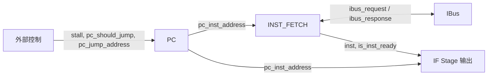

# 架构 v2 设计总纲

本文档是项目重构（v2）的总纲，记录目录布局、全局命名与接口约定、各 stage 的模块边界，以及尚未敲定的遗留问题。

---

## 1. 总则

### 1.1 重构策略

采用**并行全重写**：

- 旧代码 `vsrc/src/` 整体保留为 **v1 参考实现**，只读，不再维护。
- 新代码写入 `vsrc/src_new/`，从第一行起严格遵守本文档约定。
- 逐 stage 迁移：每个 stage 先在本文档登记边界，再落地代码，然后接入 v2 Top。
- 迁移期间 `core.sv` 仍 include v1 Top，Difftest 正常运行；等 v2 Top 能端到端跑通后再切 include。

### 1.2 不动的外部边界

以下接口在整个 v2 迁移过程中**不变**：

- `core.sv` 与 Difftest 的对接（`commit_*`、`gpr`）
- 总线接口类型 `ibus_req_t / ibus_resp_t / dbus_req_t / dbus_resp_t`（见 `vsrc/include/common.sv`）
- `clk` / `reset`（高有效）由 `core.sv` 转成 `rst_n`（低有效）传入 Top

### 1.3 目录布局

```
vsrc/
├── include/           # 基础类型、总线定义，v1/v2 共用
├── src/               # v1 参考实现，只读
├── src_new/           # v2 新代码，所有新开发在此
└── util/              # 总线桥、仲裁器等，v1/v2 共用
```

---

## 2. 全局命名与接口约定

### 2.1 system_input 约定

每个模块默认都有 `clk` 和 `rst_n`（低有效复位）两个输入。在文档与注释中将这两个信号统一称为 **system_input**；**代码里不打包**，端口仍展开为 `clk, rst_n` 两根独立线。

```systemverilog
module Example (
    input  logic clk,
    input  logic rst_n,

    // 其它端口...
);
```

### 2.2 端口与信号命名

原则：**软件化、语义优先，不靠后缀标方向或时序**。

| 类别 | v1 风格（废弃） | v2 风格 |
| --- | --- | --- |
| 输入端口 | `op_code_i`、`alu_input_i` | `op_code`、`alu_input` |
| 输出端口 | `alu_core_res_o`、`if_id_o` | `alu_core_res`、`if_id` |
| 寄存器 | `product_q`、`pc_q` | `product`、`pc_inst_address` |
| 中间信号 | `op1_abs` | `op1_abs` | （不变，本来就语义化）|

补充规则：

- 端口名直接用其**业务语义**（例：`pc_inst_address`、`is_inst_ready`、`pc_jump_address`、`pc_should_jump`）。
- 布尔信号建议 `is_*` / `has_*` / `should_*` 等软件风格前缀。
- 当同名信号既做端口又做内部连线时，以模块内不冲突为准，不再用后缀区分。

### 2.3 模块端口的 bundle 描述

每个模块的端口在**设计文档**里按功能分组（bundle）呈现，代码里用**空行**分隔对应组。bundle 不是 SV 类型，只是书写约定。

典型 bundle 命名：

- `system_input`：clk + rst_n
- `{module}_input` / `{module}_output`：该模块的主业务输入 / 输出
- `{module}_2_{peer}` / `{peer}_2_{module}`：与具体对端（总线、其它模块）通信的信号组

文档里用表格展开 bundle 内各端口：

| 端口 | 方向 | 说明 |
| --- | --- | --- |
| `pc_inst_address` | output | 当前取指 PC |
| ... | ... | ... |

### 2.4 保留的旧规则

以下 v1 约定继续有效：

- **位宽类型**：`uN`（如 `u64`、`u32`、`u5`）表示无符号 N 位
- **typedef**：`*_t` 后缀（如 `addr_t`、`word_t`、`cbus_req_t`）
- **枚举 / 包名**：SCREAMING_SNAKE_CASE（如 `ALU_OP_CODE`、`ALU_INST`）
- **模块名**：PascalCase（如 `ALU_Core`、`IF_Stage`）
- **复位**：`rst_n` 低有效
- **代码注释**：中文优先，单行简短

### 2.5 流水线寄存器放置

> **TODO**：等第一对相邻 stage（IF ↔ ID）边界都定下来之后，在此敲定统一做法（inline 在 stage 内部 `always_ff` vs 独立 `*_Reg` 模块）。在此之前，新模块内部的时序逻辑参考 IF Stage 规约中 PC 的写法。

---

## 3. 模块边界

### 3.1 IF Stage

IF Stage 内部有两个子模块：

- **PC**：程序计数器
- **INST_FETCH**：取指单元，直接对接 `ibus`

IF Stage 自身直接与 `ibus` 连接。

#### 3.1.1 PC 子模块

**pc_input**

| 端口 | 方向 | 说明 |
| --- | --- | --- |
| system_input | input | `clk` + `rst_n` |
| `stall` | input | 为高时 PC 保持不变 |
| `pc_should_jump` | input | 为高时下周期 PC 跳转到 `pc_jump_address` |
| `pc_jump_address` | input | 跳转目标地址 |

**pc_output**

| 端口 | 方向 | 说明 |
| --- | --- | --- |
| `pc_inst_address` | output | 当前指令 PC |

#### 3.1.2 INST_FETCH 子模块

**if_input**

| 端口 | 方向 | 说明 |
| --- | --- | --- |
| system_input | input | `clk` + `rst_n` |
| `pc_inst_address` | input | 要取指的地址 |

**if_output**

| 端口 | 方向 | 说明 |
| --- | --- | --- |
| `inst` | output | 取到的指令 |
| `is_inst_ready` | output | 指令是否已就绪 |

**if_2_ibus**

| 端口 | 方向 | 说明 |
| --- | --- | --- |
| `ibus_request` | output | 对 ibus 的请求 |

**ibus_2_if**

| 端口 | 方向 | 说明 |
| --- | --- | --- |
| `ibus_response` | input | 来自 ibus 的响应 |

#### 3.1.3 IF Stage 顶层接口

**IF_stage_input**

| 端口 | 方向 | 说明 |
| --- | --- | --- |
| system_input | input | `clk` + `rst_n` |
| `stall` | input | 流水线暂停 |
| `pc_should_jump` | input | 跳转使能 |
| `pc_jump_address` | input | 跳转目标 |

**IF_stage_output**

| 端口 | 方向 | 说明 |
| --- | --- | --- |
| `inst` | output | 当前取到的指令 |
| `pc_inst_address` | output | 对应 PC |

（IF Stage 另有 `if_2_ibus` / `ibus_2_if` 两个直通到 ibus 的 bundle。）

#### 3.1.4 数据流示意



### 3.2 其它 stage

> 待定。ID / EX / MEM / WB 的边界尚未给出，按用户逐 stage 下发的规约在此补充。

---

## 4. 遗留问题 / 待定

- **stall 与分支控制信号的产生者**：v1 把 hazard 逻辑散在 Top.sv 里。v2 需要一个新的控制层负责产生 `stall`、`pc_should_jump`、`pc_jump_address` 等，但其形态（独立模块？分布在各 stage？）尚未决定。
- **ID / EX / MEM / WB 边界**：待用户按 IF Stage 的同样格式给出。
- **stage-to-stage 流水线寄存器**：放在 stage 内部（v1 做法）还是拆成独立 `*_Reg` 模块，尚未决定；一旦定下第一对 stage 边界就在 §2.5 敲定。
- **v2 pipeline 包**：v1 的 `pipeline_pkg.sv` 定义了 `if_id_t / id_ex_t / ...` 等 stage-to-stage struct。v2 的对应包等相邻 stage 边界都确定后再建。
- **v2 Top 命名**：v2 顶层模块是否沿用 `Top`（通过 include 路径区分 v1/v2），还是改名为 `TopV2`，待第一个 stage 落地时决定。
