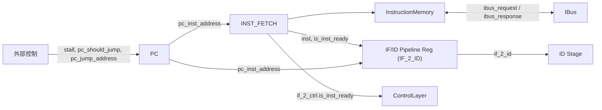
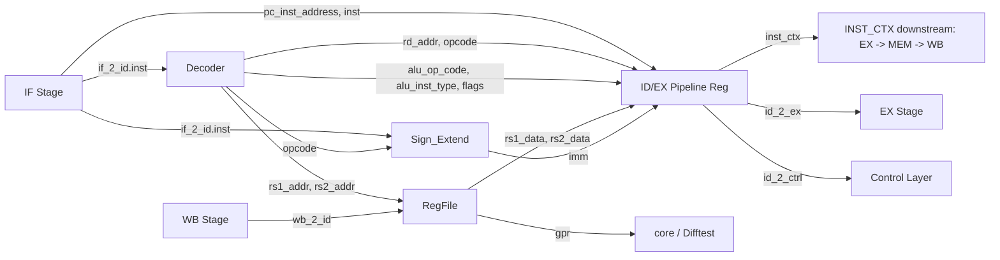
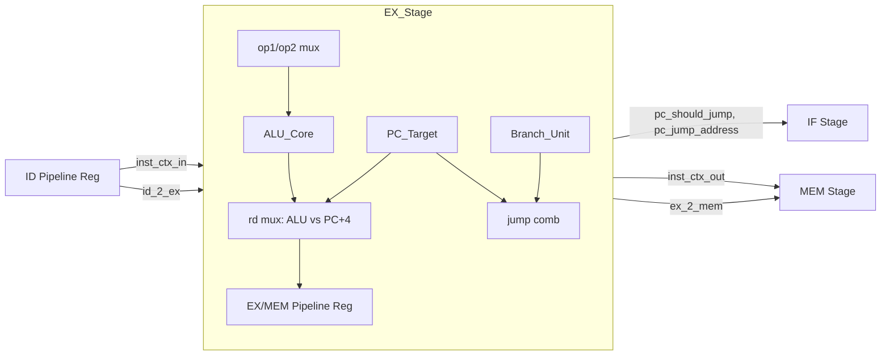

# 架构 v2 设计总纲

本文档是项目重构（v2）的总纲，记录目录布局、全局命名与接口约定、各 stage 的模块边界**规约**，以及尚未敲定的遗留问题。

> 已落地的 stage 当前**实际**接口快照见 [implemented_stages.md](implemented_stages.md)。本文偏"应当如何"，那份偏"当前是什么"。

---

## 1. 总则

### 1.1 重构策略

采用**并行全重写**：

- 旧代码 `vsrc/src/` 整体保留为 **v1 参考实现**，只读，不再维护。
- 新代码写入 `vsrc/src_new/`，从第一行起严格遵守本文档约定。
- 逐 stage 迁移：每个 stage 先在本文档登记边界，再落地代码，然后接入 v2 Top。
- 迁移期间 `core.sv` 仍 include v1 Top，Difftest 正常运行；等 v2 Top 能端到端跑通后再切 include。

### 1.2 不动的外部边界

以下接口在整个 v2 迁移过程中**不变**：

- `core.sv` 与 Difftest 的对接（`commit_*`、`gpr`）
- 总线接口类型 `ibus_req_t / ibus_resp_t / dbus_req_t / dbus_resp_t`（见 `vsrc/include/common.sv`）
- `clk` / `reset`（高有效）由 `core.sv` 转成 `rst_n`（低有效）传入 Top

### 1.3 目录布局

```text
vsrc/
├── include/           # 基础类型、总线定义，v1/v2 共用
├── src/               # v1 参考实现，只读
├── src_new/           # v2 新代码，所有新开发在此
└── util/              # 总线桥、仲裁器等，v1/v2 共用
```

---

## 2. 全局命名与接口约定

### 2.1 system_input 约定

每个模块默认都有 `clk` 和 `rst_n`（低有效复位）两个输入。在文档与注释中将这两个信号统一称为 **system_input**；**代码里不打包**，端口仍展开为 `clk, rst_n` 两根独立线。

```systemverilog
module Example (
    input  logic clk,
    input  logic rst_n,

    // 其它端口...
);
```

### 2.2 端口与信号命名

原则：**软件化、语义优先，不靠后缀标方向或时序**。

| 类别 | v1 风格（废弃） | v2 风格 |
| --- | --- | --- |
| 输入端口 | `op_code_i`、`alu_input_i` | `op_code`、`alu_input` |
| 输出端口 | `alu_core_res_o`、`if_id_o` | `alu_core_res`、`if_id` |
| 寄存器 | `product_q`、`pc_q` | `product`、`pc_inst_address` |
| 中间信号 | `op1_abs` | `op1_abs`（不变，本来就语义化） |

补充规则：

- 端口名直接用其**业务语义**（例：`pc_inst_address`、`is_inst_ready`、`pc_jump_address`、`pc_should_jump`）。
- 布尔信号建议 `is_*` / `has_*` / `should_*` 等软件风格前缀。
- 当同名信号既做端口又做内部连线时，以模块内不冲突为准，不再用后缀区分。

### 2.3 模块端口的 bundle 描述

每个模块的端口在**设计文档**里按功能分组（bundle）呈现，代码里用**空行**分隔对应组。bundle 不是 SV 类型，只是书写约定。

典型 bundle 命名：

- `system_input`：clk + rst_n
- `{module}_input` / `{module}_output`：该模块的主业务输入 / 输出
- `{module}_2_{peer}` / `{peer}_2_{module}`：与具体对端（总线、其它模块）通信的信号组

文档里用表格展开 bundle 内各端口：

| 端口 | 方向 | 说明 |
| --- | --- | --- |
| `pc_inst_address` | output | 当前取指 PC |
| ... | ... | ... |

### 2.4 保留的旧规则

以下 v1 约定继续有效：

- **位宽类型**：`uN`（如 `u64`、`u32`、`u5`）表示无符号 N 位
- **枚举 / 包名**：SCREAMING_SNAKE_CASE（如 `ALU_OP_CODE`、`ALU_INST`）
- **模块名**：PascalCase（如 `ALU_Core`、`IF_Stage`）
- **复位**：`rst_n` 低有效
- **代码注释**：中文优先，单行简短

**v2 typedef 不加 `_t` 后缀**（如 `IF_2_ID`、`ID_2_EX`）；v1 `common.sv` 中的 `addr_t / word_t / cbus_req_t / ibus_req_t` 等类型保留 `_t`，不在本轮重命名范围。

### 2.5 流水线寄存器放置

v2 的统一做法是**流水线寄存器放在上游 stage 内部**。每个 stage 的输出端口即该 stage 末尾流水线寄存器的输出，下一 stage 从组合层开始，不再有 inline 的 stage-to-stage 寄存器模块。

### 2.6 stage 间类型登记

所有 stage-to-stage 传递的包类型（`IF_2_ID`、`ID_2_EX`、`EX_2_MEM`、`MEM_2_WB` 等）以及 stage 对控制层的反馈包（如 `IF_2_CTRL`、`ID_2_CTRL`）统一在 `vsrc/src_new/top_pkg.sv` 中以 `struct packed` 声明；结构体字段名沿用端口语义名（例：`IF_2_ID` 含 `inst`、`pc_inst_address`）。

EX Stage 子单元相关枚举（`ALU_OP_CODE` / `ALU_INST` / `BRANCH_OP` / `RD_SRC` / `JUMP_TYPE`）在 [vsrc/src_new/EX/EX_PKG.sv](../vsrc/src_new/EX/EX_PKG.sv) 单独声明，由 `top_pkg.sv` include 并 `import EX_PKG::*;` 后 re-export，下游 stage 只需 `import top_pkg::*;` 即可使用。

ID 内部用的 RISC-V opcode / funct 常量（`OP_IMM / OP / OP_LOAD / ...`）在 [vsrc/src_new/ID/ID_PKG.sv](../vsrc/src_new/ID/ID_PKG.sv) 单独声明，仅 ID Stage 内部 import，不经 `top_pkg` 透出。

**按字段生命周期拆 bundle**：

- **贯穿型 bundle**：从某 stage 起顺着流水线一路透传到终点的字段，抽成独立类型（如 `INST_CTX` = `pc_inst_address / inst / rd_addr / opcode`），**不**塞进相邻两 stage 的 `{A}_2_{B}` 里。每个 stage 顶层各开一路同名端口（`inst_ctx` 输入 / `inst_ctx` 输出）原样透传，rd_addr 等"出生在 ID、死在 WB"的字段顺这条链走。
- **相邻型 bundle**：只在相邻两 stage 间传、下一 stage 消费完就丢的字段，才用 `{A}_2_{B}` 命名（如 `ID_2_EX` 只含 `rs1_data / rs2_data / imm / is_op1_zero / is_op2_imm / alu_op_code / alu_inst_type`，EX 吃完即止）。
- **控制层反馈 bundle**：stage 给控制层看的信号（如 `IF_2_CTRL`、`ID_2_CTRL`），与流水线主干分开走，不进 `{A}_2_{B}`。

---

## 3. 模块边界

### 3.1 IF Stage

IF Stage 内部有两个子模块：

- **PC**：程序计数器
- **INST_FETCH**：取指单元，直接对接 `ibus`

IF Stage 自身直接与 `ibus` 连接。

#### 3.1.1 PC 子模块

#### pc_input

| 端口 | 方向 | 说明 |
| --- | --- | --- |
| system_input | input | `clk` + `rst_n` |
| `stall` | input | 为高时 PC 保持不变 |
| `pc_should_jump` | input | 为高时下周期 PC 跳转到 `pc_jump_address` |
| `pc_jump_address` | input | 跳转目标地址 |

#### pc_output

| 端口 | 方向 | 说明 |
| --- | --- | --- |
| `pc_inst_address` | output | 当前指令 PC |

#### 3.1.2 INST_FETCH 子模块

#### if_input

| 端口 | 方向 | 说明 |
| --- | --- | --- |
| system_input | input | `clk` + `rst_n` |
| `pc_inst_address` | input | 要取指的地址 |

#### if_output

| 端口 | 方向 | 说明 |
| --- | --- | --- |
| `inst` | output | 取到的指令 |
| `is_inst_ready` | output | 指令是否已就绪 |

#### if_2_ibus

| 端口 | 方向 | 说明 |
| --- | --- | --- |
| `ibus_request` | output | 对 ibus 的请求 |

#### ibus_2_if

| 端口 | 方向 | 说明 |
| --- | --- | --- |
| `ibus_response` | input | 来自 ibus 的响应 |

INST_FETCH 内部实例化 `InstructionMemory` 子模块处理 ibus 握手。

#### 3.1.3 InstructionMemory 子模块

纯薄 ibus 握手适配器，隶属于 INST_FETCH 内部。

#### im_input

| 端口 | 方向 | 说明 |
| --- | --- | --- |
| system_input | input | `clk` + `rst_n` |
| `request_addr` | input | 请求地址 |
| `request_valid` | input | 是否发出请求 |

#### im_output

| 端口 | 方向 | 说明 |
| --- | --- | --- |
| `response_data` | output | ibus 返回的指令字 |
| `is_response_valid` | output | 本周期 `response_data` 是否有效 |

#### im_2_ibus

| 端口 | 方向 | 说明 |
| --- | --- | --- |
| `ibus_request` | output | 组合传递给 ibus 的请求 |

#### ibus_2_im

| 端口 | 方向 | 说明 |
| --- | --- | --- |
| `ibus_response` | input | 来自 ibus 的响应 |

`request_*` 直接映射到 `ibus_request`，`ibus_response.data / data_ok` 同周期透出到 `response_*`；ibus 合约"`valid` 拉高到 `data_ok` 期间 `addr` 稳定"由调用方（Inst_Fetch + PC 的 `pc_stall`）保证。

#### 3.1.4 IF Stage 顶层接口

#### IF_stage_input

| 端口 | 方向 | 说明 |
| --- | --- | --- |
| system_input | input | `clk` + `rst_n` |
| `stall` | input | 流水线暂停 |
| `pc_should_jump` | input | 跳转使能 |
| `pc_jump_address` | input | 跳转目标 |

#### IF_stage_output

| 端口 | 方向 | 说明 |
| --- | --- | --- |
| `if_2_id` | output | IF/ID 流水线寄存器输出，类型 `IF_2_ID`（含 `inst`、`pc_inst_address`） |

#### if_2_ctrl

| 端口 | 方向 | 说明 |
| --- | --- | --- |
| `if_2_ctrl` | output | IF 对控制层的反馈，类型 `IF_2_CTRL`，当前仅含 `is_inst_ready` |

（IF Stage 另有 `if_2_ibus` / `ibus_2_if` 两个直通到 ibus 的 bundle。）

#### 3.1.5 IF Stage 内部时序

- **PC 内部优先级**：`rst_n > pc_should_jump > stall > 自增`
- **IF_Stage 对 PC 的 stall**：`pc_stall = stall || !is_inst_ready`，由 IF_Stage 组合产生并喂给 `PC.stall`；PC 自身端口不感知 `is_inst_ready`
- **IF 对控制层反馈**：`if_2_ctrl.is_inst_ready = is_inst_ready`，未来控制层可据此生成全局 `stall`
- **IF/ID 寄存器更新条件**：`is_inst_ready && !stall` 时 latch 新数据，否则保持
- **跳转时 IF/ID**：当前实现为**保持上一拍**，不清零；flush 语义由未来控制层定义

#### 3.1.6 数据流示意



### 3.2 ID Stage

ID Stage 内部有三个子模块：

- **Decoder**：纯组合，从 32bit 指令字解出各字段 + ALU 控制 + 两个操作数选择 flag
- **RegFile**：32×64 寄存器堆，一写两读，x0 硬连 0，附 32 根 `gpr` 快照出口
- **Sign_Extend**：按 opcode 把立即数扩展到 64 位

ID Stage 顶层把三者装配起来，并在末尾放 **ID/EX 流水线寄存器**。该寄存器的输出在 ID Stage 顶层拆成**两个语义不同的端口**：

- `inst_ctx`（`INST_CTX` 类型）：贯穿 pipeline 的指令上下文
- `id_2_ex`（`ID_2_EX` 类型）：仅供 EX 消费的操作数与 ALU 控制

#### 3.2.1 Decoder 子模块

纯组合，无 system_input。

#### decoder_input

| 端口 | 方向 | 说明 |
| --- | --- | --- |
| `inst` | input | 指令字 |

#### decoder_output

| 端口 | 方向 | 说明 |
| --- | --- | --- |
| `opcode` | output | RISC-V 7 位 opcode |
| `rd_addr` | output | 目的寄存器号，S/B-type 已清零 |
| `rs1_addr` | output | 源寄存器 1 号 |
| `rs2_addr` | output | 源寄存器 2 号（原始 `inst[24:20]`） |
| `alu_op_code` | output | ALU 操作码 `ALU_OP_CODE` |
| `alu_inst_type` | output | ALU 操作宽度 `ALU_INST`（NORM / WORD） |
| `is_op1_zero` | output | 为高时 EX 把 op1 当 0（LUI 场景） |
| `is_op2_imm` | output | 为高时 EX 用 imm 代替 rs2 作为 op2（OP-IMM / Load / Store / LUI / AUIPC） |

#### 3.2.2 RegFile 子模块

#### regfile_write

| 端口 | 方向 | 说明 |
| --- | --- | --- |
| system_input | input | `clk` + `rst_n` |
| `write_en` | input | 写使能 |
| `write_addr` | input | 写地址；x0 写入被屏蔽 |
| `write_data` | input | 写数据 |

#### regfile_read

| 端口 | 方向 | 说明 |
| --- | --- | --- |
| `read_addr_1` | input | 读端口 1 地址 |
| `read_addr_2` | input | 读端口 2 地址 |
| `read_data_1` | output | 读端口 1 数据；x0 恒 0 |
| `read_data_2` | output | 读端口 2 数据；x0 恒 0 |

#### regfile_snapshot

| 端口 | 方向 | 说明 |
| --- | --- | --- |
| `gpr` | output | `u64 [0:31]`，供 Difftest 比对 |

#### 3.2.3 Sign_Extend 子模块

纯组合，无 system_input。按 opcode 区分 I / S / B / U / J 五种格式拼出立即数并 sext 到 64 位。

#### sign_extend_input

| 端口 | 方向 | 说明 |
| --- | --- | --- |
| `inst` | input | 指令字 |
| `opcode` | input | 决定立即数格式 |

#### sign_extend_output

| 端口 | 方向 | 说明 |
| --- | --- | --- |
| `imm` | output | 64 位 sign-extended 立即数 |

#### 3.2.4 ID Stage 顶层接口

#### ID_stage_input

| 端口 | 方向 | 说明 |
| --- | --- | --- |
| system_input | input | `clk` + `rst_n` |
| `stall` | input | 为高时 ID/EX 流水线寄存器保持 |
| `if_2_id` | input | 来自 IF stage，类型 `IF_2_ID` |
| `wb_2_id` | input | 来自 WB 的写回，类型 `WB_2_ID` |

#### ID_stage_output

| 端口 | 方向 | 说明 |
| --- | --- | --- |
| `inst_ctx` | output | ID/EX 寄存器后的指令上下文，类型 `INST_CTX`，贯穿 pipeline |
| `id_2_ex` | output | ID/EX 寄存器后的 EX 操作数 + ALU 控制，类型 `ID_2_EX` |
| `gpr` | output | `u64 [0:31]` 快照，透出供 Difftest |

#### id_2_ctrl

| 端口 | 方向 | 说明 |
| --- | --- | --- |
| `id_2_ctrl` | output | ID 对控制层反馈，类型 `ID_2_CTRL`；当前仅 `placeholder` 占位 |

#### 3.2.5 数据流示意



#### 3.2.6 关键设计点

- **操作数 split 形态**：`id_2_ex.rs1_data / rs2_data` 是 RegFile 的原始读值，**不**做 v1 的 LUI/imm 融合；是否把 op1 当 0、是否用 imm 代替 op2，由 EX 阶段根据 `is_op1_zero / is_op2_imm` 做 mux。store 时下游直接用 `rs2_data`，不再单独维护 `store_data` 字段。
- **rd_addr 清零点**：S/B-type 无架构 rd，Decoder 内部就把 `rd_addr` 清零；EX/MEM/WB 无需再判 opcode。
- **INST_CTX 贯穿**：`inst_ctx` 从 ID 出发顺着每个 stage 原样透传，WB 据 `inst_ctx.rd_addr` 写回、commit 据 `inst_ctx.pc_inst_address / inst` 对账；MEM 据 `inst_ctx.opcode` 识别 load/store。
- **ID/EX 寄存器更新条件**：`!stall` 时 latch 新数据；复位同步清零。`inst_ctx` 与 `id_2_ex` 物理上为同一组寄存器，只是按语义拆成两个端口。
- **flush 语义**：跳转时 ID/EX 暂按"保持"处理，与 IF/ID 的处理一致；未来控制层若要求显式清零再校准。
- **WB 写回**：`wb_2_id.write_en / write_addr / write_data` 直接接到 `RegFile.regfile_write`，零转接；x0 写入由 RegFile 内部屏蔽。
- **id_2_ctrl**：本轮仅 `placeholder`；未来放 `rs1_addr / rs2_addr / is_rs*_used` 等 hazard 判定信号，随控制层形态一起定。

### 3.3 EX Stage

EX Stage 内部有三个子模块：

- **ALU_Core**：64-bit 算术 / 逻辑 / 移位 / 比较，NORM 与 WORD 两种位宽
- **Branch_Unit**：条件分支判定（6 种）
- **PC_Target**：产 `pc_plus_4`（JAL/JALR 的 rd 源）与 `jump_target`

EX Stage 顶层把三者装配起来，在组合层做 op1/op2 mux、rd mux、跳转判定；末尾放 **EX/MEM 流水线寄存器**，输出 `inst_ctx_out` 与 `ex_2_mem`。分支/跳转信号 `pc_should_jump` / `pc_jump_address` 为**组合直出**，本拍反馈给 IF Stage，不经寄存器（IF 当拍可转向）。

#### 3.3.1 ALU_Core 子模块

纯组合，无 system_input。

#### alu_core_input

| 端口 | 方向 | 说明 |
| --- | --- | --- |
| `op_code` | input | `ALU_OP_CODE`，决定运算种类 |
| `inst_type` | input | `ALU_INST`，NORM 全 64-bit / WORD 低 32-bit 运算再 sext |
| `alu_input_1 / alu_input_2` | input | 两个 64-bit 操作数（已由 EX_Stage 顶层 mux 过） |

#### alu_core_output

| 端口 | 方向 | 说明 |
| --- | --- | --- |
| `alu_core_res` | output | 64-bit 运算结果 |

支持 `ADD / SUB / AND / OR / XOR / SLL / SRL / SRA / SLT / SLTU`。WORD 下 `SLL/SRL/SRA` 用低 5 位移位量，NORM 用低 6 位；`SLT/SLTU` 仅 NORM（RISC-V 无字版本）。

#### 3.3.2 Branch_Unit 子模块

纯组合，按 `branch_op` 对 `rs1_data / rs2_data` 做比较，输出 `is_branch_taken`。吃的是**原始** rs1/rs2，不走 EX 顶层的 op1/op2 mux。

| 端口 | 方向 | 说明 |
| --- | --- | --- |
| `branch_op` | input | `BRANCH_OP`：`BR_EQ/NE/LT/GE/LTU/GEU` |
| `rs1_data / rs2_data` | input | 原始寄存器读值 |
| `is_branch_taken` | output | 分支是否成立 |

#### 3.3.3 PC_Target 子模块

纯组合，同时产 `pc_plus_4` 与 `jump_target`。

| 端口 | 方向 | 说明 |
| --- | --- | --- |
| `jump_type` | input | `JUMP_TYPE` |
| `pc_inst_address` | input | 当前指令 PC |
| `rs1_data` | input | JALR 的基址 |
| `imm` | input | J/B/I 类立即数 |
| `pc_plus_4` | output | `pc_inst_address + 4`，供 JAL/JALR 的 rd |
| `jump_target` | output | `JT_JALR` → `(rs1+imm) & ~1`，`JT_JAL/JT_BR` → `pc_inst_address + imm`，`JT_NONE` → 0 |

#### 3.3.4 EX Stage 顶层接口

#### EX_stage_input

| 端口 | 方向 | 说明 |
| --- | --- | --- |
| system_input | input | `clk` + `rst_n` |
| `stall` | input | EX/MEM 流水寄存器暂停 |
| `inst_ctx_in` | input | 来自 ID，类型 `INST_CTX` |
| `id_2_ex` | input | 来自 ID，类型 `ID_2_EX` |

#### EX_stage_output

| 端口 | 方向 | 说明 |
| --- | --- | --- |
| `inst_ctx_out` | output | 透传，类型 `INST_CTX` |
| `ex_2_mem` | output | EX/MEM 流水寄存器输出，类型 `EX_2_MEM`，含 `ex_result` 与 `rs2_data` |

#### ex_2_pc_feedback

| 端口 | 方向 | 说明 |
| --- | --- | --- |
| `pc_should_jump` | output | 组合直出，本拍反馈 IF |
| `pc_jump_address` | output | 组合直出，本拍反馈 IF |

未来控制层落地后，这两根端口应改名为 `ex_2_ctrl` bundle，由控制层统一派发。

#### 3.3.5 数据流示意



#### 3.3.6 关键设计点

- **op1 mux 优先级**：`is_op1_zero > is_op1_pc > rs1_data`。`LUI` 用 `is_op1_zero`，`AUIPC` 用 `is_op1_pc`。
- **op2 mux**：`is_op2_imm ? imm : rs2_data`。
- **rd 写回候选**：`rd_src == RD_FROM_PC_PLUS_4` 时选 `pc_plus_4`（JAL/JALR），否则选 `alu_core_res`。AUIPC 走 ALU（op1=PC, op2=imm, ADD），不走 PC+4。
- **分支判定吃原 rs1/rs2**：Branch_Unit 不经 mux，因此条件分支时 `rs1_data / rs2_data` 必须是 RegFile 原始读值（而 OP_BRANCH 类 Decoder 默认不置 `is_op2_imm`，保证 `id_2_ex.rs2_data` 就是寄存器原值）。
- **跳转组合直出**：`pc_should_jump` / `pc_jump_address` 由 EX 组合层直接输出到 IF。`JT_JAL / JT_JALR` 无条件跳；`JT_BR` 由 `is_branch_taken` 决定。
- **store_data 走 ex_2_mem.rs2_data**：store 时 EX 不消费 rs2，透过 `ex_2_mem.rs2_data` 传给 MEM（与 v1 `store_data` 字段对应）。
- **EX/MEM 寄存器更新条件**：`!stall` 时 latch `inst_ctx` 与 `ex_2_mem`；复位清零。
- **乘除法暂缺**：`MUL / DIV / REM` 与 `ALU_STATE` 本轮未迁移；`Decoder` 对 `funct7 == FUNCT7_M` 的路径当前走默认值（产出 ADD），等乘除法回归再接回 ALU_OP_CODE 新槽位。

---

## 4. 遗留问题 / 待定

- **stall 与分支控制信号的产生者**：v1 把 hazard 逻辑散在 Top.sv 里。v2 需要一个新的控制层负责产生 `stall`、聚合分支/跳转；当前 IF 提供 `if_2_ctrl.is_inst_ready`，ID 留了 `id_2_ctrl`（仅 `placeholder`）占位，EX 暂以 `pc_should_jump` / `pc_jump_address` 两根裸端口把跳转反馈直接送回 IF。控制层形态（独立模块？分布在各 stage？）尚未决定；未来 EX 的两根裸端口应收拢为 `ex_2_ctrl` bundle。
- **MEM / WB 边界**：待用户按 IF / ID / EX Stage 的同样格式给出。两者顶层都应挂一路 `inst_ctx` 输入与输出原样透传。EX Stage 已完整落地（三子模块 + 22 条新指令），乘除法（`MUL/DIV/REM` 及 FSM 状态 `ALU_STATE`）暂不迁移，`ALU_OP_CODE` 已预留槽位，待乘除法回归时填回。
- **ID_2_CTRL 字段集合**：`rs1_addr / rs2_addr / is_rs1_used / is_rs2_used / is_store_src_used` 等 hazard 判定信号应放进 `ID_2_CTRL`，具体集合随控制层形态一起定；当前仅 `placeholder`。
- **INST_CTX 是否细化**：目前 `INST_CTX.opcode` 原样随流，MEM 识别 load/store 用。未来若要换成 `is_load / is_store / is_branch / is_jump` 等语义化 flag 并归到独立的 `MEM_CTRL` bundle，留到 MEM / EX stage 规约时再决定。
- **跳转时 IF/ID、ID/EX flush 语义**：当前两级流水线寄存器在跳转周期都按"保持"处理，不清零；未来控制层可能要求显式清零。届时再校准。
- **v2 Top 命名**：v2 顶层模块是否沿用 `Top`（通过 include 路径区分 v1/v2），还是改名为 `TopV2`，待第一个 stage 落地时决定。
