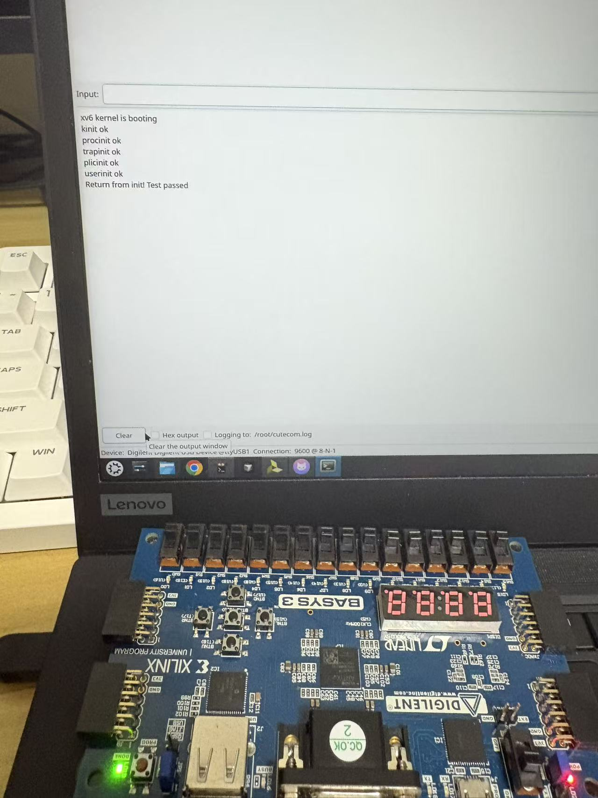

# Lab5 实验报告

## 特权实现

我们在CTRL模块中添加了Privilege_Unit模块，用于处理特权级相关的逻辑。

Privilege_Unit可以视作一个切面探测器，用于探测特权级相关的逻辑。它在内部维护了一个2位的寄存器，用于存储当前的特权级。

Privilege_Unit的输入包括：

- wb_trap_event：WB阶段反馈的trap事件
- mstatus / mtvec_value / mepc_value：来自CSRFile的当拍读出
- interrupt_pending：中断是否pending

Privilege_Unit的输出包括：

- trap_write_en：trap写使能
- trap_mstatus_next：trap写mstatus
- trap_mepc_next：trap写mepc
- trap_mcause_next：trap写mcause
- trap_mtval_next：trap写mtval

## mmu实现

我们一开始选择将MMU模块放置在dbus和cbus之间，后来发现自己实现的arbiter难以定位问题，因此最后决定在给定的Cbus后放置mmu模块

## 问题

上板时，mmu的访存时序遇到了问题，我们通过WAIT一个周期解决了问题。后续可能应该写更好的握手机制。

## 测试

test通过，上板测试记录如下：

