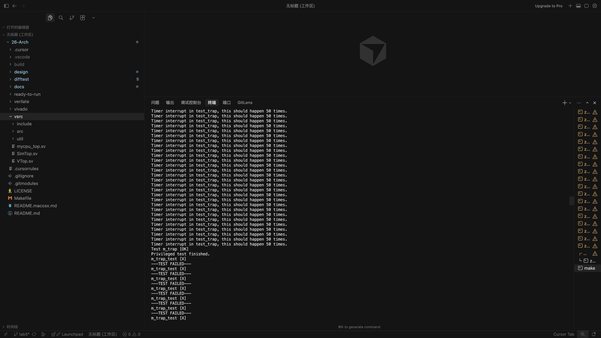

# Lab6 实验报告

## 中断实现

我们在CTRL模块中添加了Interrupt_Unit模块，用于处理中断相关的逻辑。

负责：

硬件 mip（trint / swint / exint）与 CSR 软件位 OR
边沿检测 + pending_latched 延迟投递（MIE=0 时挂起，MIE=1 后再响应）
mstatus WB bypass（csrsi 开 MIE 当拍即可参与判定）
驱动 Privilege_Unit 的 int_fire / int_mcause / int_epc

## 遇到问题

现象：Timer interrupt in test_trap, this should happen 50 times. 只出现 4 次，随后 m_trap_test [X]。

根因：m_trap_test 用极窄的 MIE 窗口测试——csrsi（开 MIE）与 csrci（关 MIE）之间只有一拍。测试要求每次定时器中断的 mepc == 0x80008048（int_allow 处）。

修复：M 模式 MTIP 只在 csrsi WB 提交当拍投递，mepc 固定为 mem_inst_ctx.pc + 4，即 csrsi 的下一条 int_allow，与测试汇编一致

## 回归修复

sfence.vma 等未实现的 SYSTEM 指令被误判为非法指令。改为当 NOP 处理，避免 Lab5 测试回退。

## 测试

【值得与TA交流汇报的测试问题】：

这次测试在macOS 26.5，M3芯片上完成。回归了6次lab，均能通过，附上lab6截图



本机调试过程中遇到了一些问题，借助agent解决了问题。

问题是什么

```shell
/Users/zhaojingyan/Code/26-Arch/Difftest/src/test/csrc/common/device.cpp:20:10: fatal error: 'SDL2/SDL.h' file not found
   20 | #include <SDL2/SDL.h>
      |          ^~~~~~~~~~~~
```

源码写的是 #include <SDL2/SDL.h>，需要编译器去找：

/opt/homebrew/include/SDL2/SDL.h
但 Homebrew 的 sdl2-config --cflags 给的是 -I/opt/homebrew/include/SDL2，编译器会去找：

/opt/homebrew/include/SDL2/SDL2/SDL.h   ← 多了一层，找不到
路径差了一层目录，所以报错。

于是修改了：

1. difftest/verilator.mk — 改 include 路径：

SDL2_PREFIX  := $(shell $(SDL2_CONFIG) --prefix)
EMU_CXXFLAGS += -I$(SDL2_PREFIX)/include -D_THREAD_SAFE

2. difftest/src/test/csrc/common/keyboard.cpp — 去掉 SDL 头文件

在这样的处理下，本机测试可以正常运行，最为反馈给到助教老师，希望能帮助到项目建设。